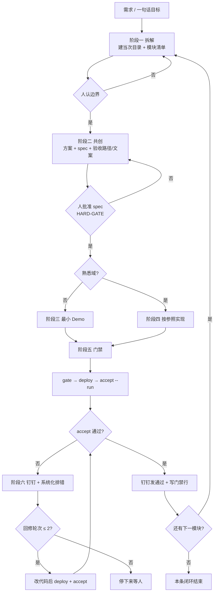
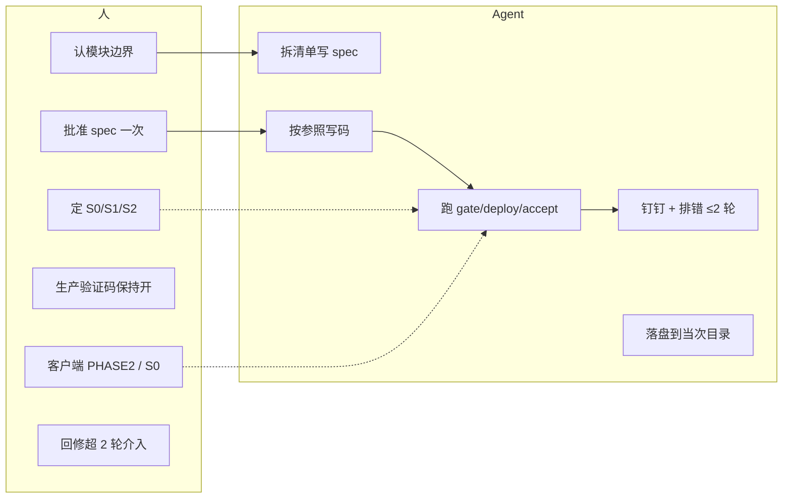
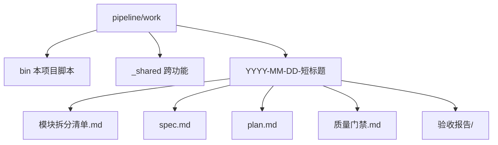
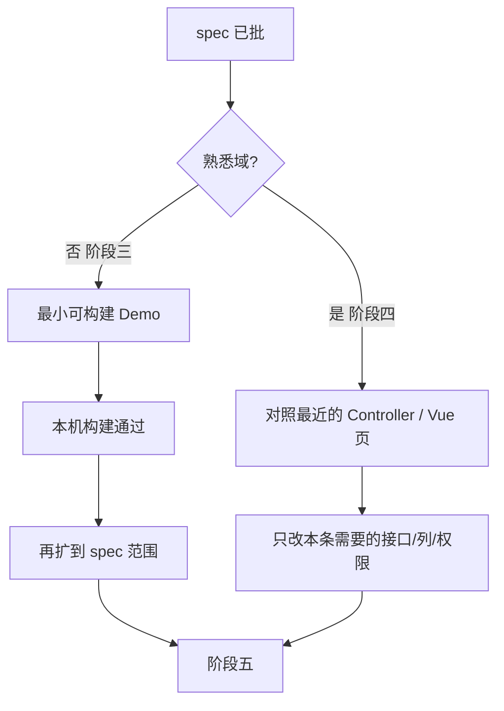
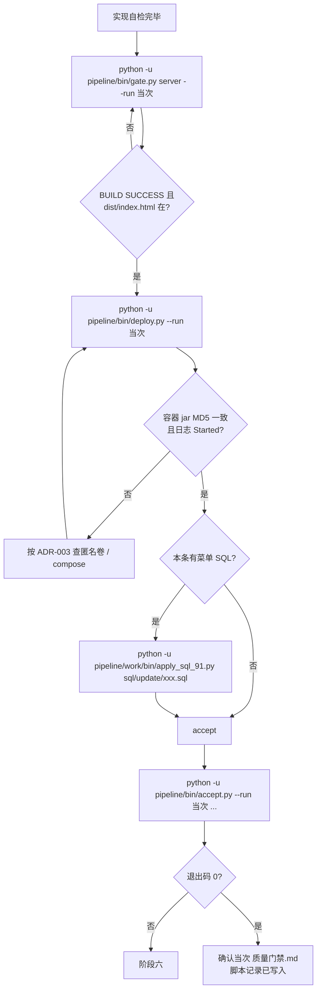
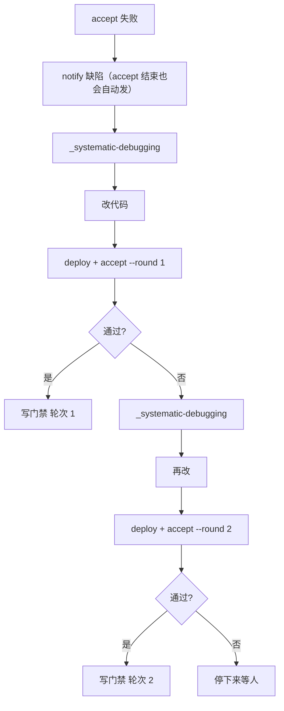
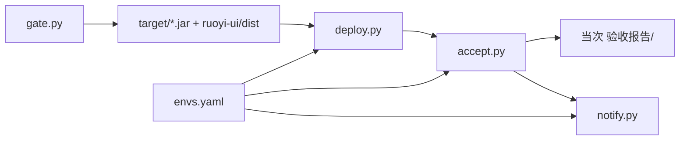
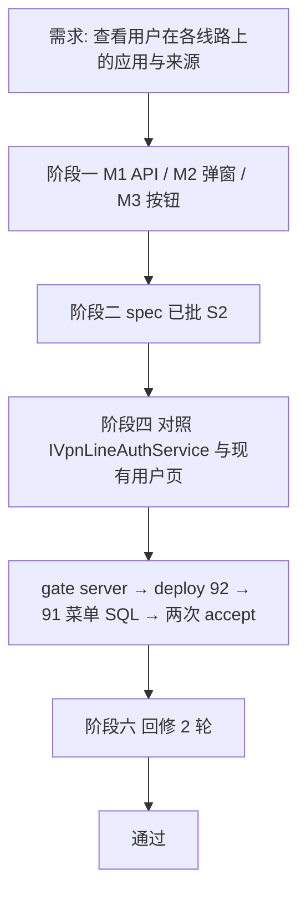

# 六阶段流水线 — Agent 执行指引

| 项 | 内容 |
|----|------|
| 适用 | 本仓库任何新功能、改模块（不另做第二条流水线） |
| 读者 | Cursor Agent；人也用这份核对「做到哪、下一步是什么」 |
| 原则 | [SOP](docs/开发+AI复杂项目六阶段工作法-SOP.md) |
| 准入准出 | [工程实施手册](docs/开发+AI复杂项目六阶段工作法-工程实施手册.md) |
| 硬门槛 | [AGENTS.md](AGENTS.md) |
| 目录怎么摆 | [README.md](README.md) |

通用怎么做（brainstorming、写 plan、完成前验证、排错、钉钉）走 [echoying-skills](http://10.13.0.176/huangzhiqing/echoying-skills)。**本项目差异**（92/93、菜单、账号、Playwright、编哪些包）只写在 `pipeline/work/`。不新建 `phase-*` Skill。对话用简体中文。

---

## 1. 总流程

一条功能 = 一次六阶段闭环。工作单元是**可独立验收的模块**，不是整仓瀑布。



人机边界：



---

## 2. 硬门槛（未满足不得往下）

1. 创造性工作先 `_brainstorming`：拆模块、出方案、写 spec 与验收标准。
2. **spec 未经人批准，不得写业务代码、不得搭脚手架。**
3. 声称完成前必须按顺序跑：`gate --run` → `deploy --run` → `accept --run`。命令来自**当前这条** spec 第 7 节。未跑过、或跑了但没带 `--run` 因而没写入当次 `质量门禁.md`，不得说已门禁。
4. 客户端要编、要打包，**不自动验收**。人勾 `ruoyi-vpn-client/docs/PHASE2_CHECKLIST.md`。
5. 页面验收失败：钉钉发缺陷 → `_systematic-debugging` → 再 deploy + accept，**最多 2 轮**。超轮次停下来等人。需求理解错了才回阶段二；实现缺陷不要丢回 brainstorming。
6. 密码、钉钉 token、SSH 只走 `pipeline/deploy/envs.yaml` 或 `.deploy/envs.yaml` 或环境变量。不入库、不写进对话。

安全级由人定，Agent 不得自行降级：

| 级 | 范围 | Agent 怎么验 |
|----|------|----------------|
| S0 | 客户端传输层、`ruoyi-vpn-auth` TCP/TLS、证书/密钥 | 只辅助；不自动验收 |
| S1 | 多线路同步、审计、钉钉验证 | 可写，人审逻辑 |
| S2 | 管理端列表/查询/标准 CRUD | 构建 + 页面验收 |

---

## 3. 目录与落盘

```
pipeline/
  六阶段流水线-Agent执行指引.md   本文件
  AGENTS.md / README.md / docs/   约定与方法
  bin/                            gate deploy accept notify
  work/
    bin/                          本项目 92/93/91 适配
    _shared/                      跨功能 ADR、门禁总表
    YYYY-MM-DD-短标题/            当次闭环（一条功能一夹）
      模块拆分清单.md
      spec.md
      plan.md
      质量门禁.md
      验收报告/
```

新功能**先建当次目录**，再写清单和 spec。不要往旧功能的清单里追加行。



---

## 4. 各阶段：Agent 逐步做什么

### 阶段一 拆解

**准入：** 业务目标不超过 5 条；技术约束已知。  
**准出：** 当次目录存在；`模块拆分清单.md` 填完技术栈、熟悉度、优先级、依赖、**一句话可演示验收标准**、安全级。  
**人：** 认边界。

Agent 步骤：

1. 读 `_brainstorming` skill，按 skill 问清范围（一次一个问题）。
2. 建 `pipeline/work/YYYY-MM-DD-短标题/`（日期用当天，标题与需求短名一致）。
3. 写当次 `模块拆分清单.md`。熟悉域标「熟悉」，陌生域标「陌生」。
4. 停下来等人认边界。未认不得写 spec 以外的业务码。

### 阶段二 共创

**准出：** spec 里写清页面路径、按钮文案、弹窗标题、接口是否 Inner、非目标。  
**人：批准一次（HARD-GATE）。**

Agent 步骤：

1. 出 2～3 个方案和取舍，推荐一个。
2. 人点头后写 `spec.md`。第 7 节必须是可复制命令，格式见 [_shared/spec-第7节-验收命令模板.md](work/_shared/spec-第7节-验收命令模板.md)。
3. 跨功能选型写 `pipeline/work/_shared/ADR-*.md`；只属于本条的决策写在当次目录。
4. 复杂实现可写 `plan.md`（默认 spec-only；跨子系统再写 plan）。
5. **等人说「批准 / 按这个做」**。未批：零业务代码。

### 阶段三 / 四 实现



Agent 步骤：

- 熟悉：对照 `YalUserAuthController` / `views/vpn/user/index.vue` 等已有页，禁止自造返回包装或整棵 views 树。
- 陌生：先最小 Demo 能编过，再扩。
- 管理端 Java：JDK8 + `clean`。
- 写操作：本地落库 → 各启用 LineApp 同步 → `*YianlianMapping`。只读汇总优先复用已有 Service。
- 不改传输层除非人定为 S0 并接受人验 PHASE2。

### 阶段五 门禁

只改管理端用 `gate.py server`（Java + 前端，不编客户端）。改了客户端才跑默认全量或 `gate.py client`。



本机命令（密码只走环境变量）：

```bash
python -u pipeline/bin/gate.py server --run <YYYY-MM-DD-短标题>
python -u pipeline/bin/deploy.py --run <YYYY-MM-DD-短标题>
python -u pipeline/bin/accept.py --run <YYYY-MM-DD-短标题> \
  --path <spec路由> --expect-text <spec文案> --module <编号> --round 0
python -u pipeline/work/bin/apply_sql_91.py sql/update/xxx.sql
```

`gate` / `deploy` / `accept` 都应带 `--run`：通过或失败都会追加到当次 `质量门禁.md` 的「脚本记录」。漏 `--run` 时构建仍会跑，但不落盘，不得据此声称门禁已记。`accept` 缺 `--run` 会直接失败。报告只写入当次 `验收报告/`。有 `--click` 时断言**弹窗标题**，不要用页面任意包含该文案的 toast。只点可见节点（Element UI 下拉有隐藏副本）。

依赖：`pip install -r pipeline/bin/requirements-admin-e2e.txt`，再 `playwright install chromium`。

改了客户端时，按当次 spec 第 7 节加 `python -u pipeline/bin/accept.py client-ref ...`。登录步骤、认验证码、踩坑见 [client-ref-走查流程.md](work/_shared/client-ref-走查流程.md)。脚本自动截桌面验证码，**Agent 自己认图并回填**（不把验证码交给人）。门禁记 **参考完成 / 参考失败**，不算 PHASE2 通过。不关桌面/选线验证码。

管理端验证码：只允许关 **92** Nacos `ruoyi-gateway-dev.yml` 的 `security.captcha.enabled`。不关桌面/选线验证码。生产保持开。

### 阶段六 迭代



- 实现缺陷：留在五 / 六，不要回 brainstorming。
- 需求理解错了：回阶段二改 spec，人再批。
- 钉钉：`python -u pipeline/bin/notify.py markdown "标题" --text-file pipeline/work/<当次>/验收报告/验收报告-YYYY-MM-DD.md`  
  无凭证则 skip、退出 0。`access_token` 只填 token 段，不要整段 webhook URL。

完成前按 `_verification-before-completion`：没有对应脚本输出，不得声称通过。

---

## 5. 本机准备（只做一次）

1. 复制 `pipeline/deploy/envs.yaml.example` 为 `pipeline/deploy/envs.yaml`（或 `.deploy/envs.yaml`），填 SSH / 管理端账号 / 钉钉。不要提交。
2. JDK 8、`mvn`、`ruoyi-ui` 已 `npm install`。
3. 能 SSH 到 92（`vpn` 时还有 93）。91 只打菜单 SQL，不随功能重部中间件。
4. Hook：`.cursor/hooks.json` 指向 `pipeline/cursor/hooks/`。改 Rule 先改 `pipeline/cursor/rules/`，再同步到 `.cursor/rules/`。



---

## 6. 已执行实例：2026-08-15 用户线路权限查询

这是用来把闭环跑通的**第一条**，不是流水线本身。之后每条功能换 spec 里的路径和文案，步骤相同。

当次目录：[work/2026-08-15-用户线路权限查询/](work/2026-08-15-用户线路权限查询/)



### 6.1 阶段一（已执行）

拆成三块，均 S2、熟悉域：

| 编号 | 模块 | 验收一句话 |
|------|------|------------|
| M1 | 汇总查询 API | `GET .../line-auths` 按线路返回应用组/应用/来源；不改 `authorized-lines` |
| M2 | 列表「查看权限」弹窗 | 线路用户 / 本地用户都能打开「线路权限」弹窗 |
| M3 | 按钮权限 | `yianlian:user:queryAuth` / `vpn:localUser:queryAuth`；无权限按钮不可见 |

非目标：不写易安联、不改客户端、不改选线/TLS。

### 6.2 阶段二（已执行）

人批准 [spec.md](work/2026-08-15-用户线路权限查询/spec.md)。要点：

- 入口：线路用户「更多 → 查看权限」；本地用户操作列「查看权限」。
- 弹窗标题：`线路权限 - {userName}`。
- API：`GET /vpn/user/{id}/line-auths`、`GET /vpn/local/user/{id}/line-auths`，非 Inner。
- 菜单：两条 `F`，父菜单 1065 / 1072。实现时 1085/1086 已被占用，改为 **1087 / 1088**。
- accept 参数写进 spec 第 7 节。

### 6.3 阶段四（已执行）

按参照实现，未走阶段三 Demo（熟悉域）：

- 后端复用 `IVpnLineAuthService` / `Yal*Auth`，不改写授权。
- 前端改 `views/vpn/user`、`views/vpn/local/user`。
- SQL：`sql/update/20260815_line_auth_query_menu.sql`，91 执行。

### 6.4 阶段五（已执行）

当时入口还是 `bin\gate.bat`（现已改为 `python pipeline/bin/gate.py`）。实际顺序：

| 步骤 | 当时怎么跑 | 结果 |
|------|------------|------|
| 构建 Java | `gate.bat server` | Maven BUILD SUCCESS |
| 构建前端 | 同上；延迟展开误报后补 `gate.bat ui` | `[gate] 通过` |
| 部署 92 | `CALL deploy-admin-92.bat` 递归失败，改直接跑 Python 部署 | `[deploy] 完成` |
| 注入 jar | 匿名卷挡住新包，`docker cp` + 核 MD5 + 等 Started | yianlian MD5 一致 |
| 菜单 | 91 执行菜单 SQL | 1087 / 1088 挂到 admin |
| accept 线路用户 | `--path /yianlian/vpn/user --click 更多 --click 查看权限 --expect-text 线路权限` | 轮次 2 通过；标题 `线路权限 - zhujunxiong` |
| accept 本地用户 | `--path /yianlian/local/user --click 查看权限 --expect-text 线路权限` | 轮次 2 通过；含穗彩开发环境、South_Africa |

现在应写成：

```bash
python -u pipeline/bin/gate.py server --run 2026-08-15-用户线路权限查询
python -u pipeline/bin/deploy.py --run 2026-08-15-用户线路权限查询
python -u pipeline/work/bin/apply_sql_91.py sql/update/20260815_line_auth_query_menu.sql
python -u pipeline/bin/accept.py --run 2026-08-15-用户线路权限查询 \
  --path /yianlian/vpn/user --click 更多 --click 查看权限 \
  --expect-text 线路权限 --title 线路用户线路权限 --module M2 --round 0
python -u pipeline/bin/accept.py --run 2026-08-15-用户线路权限查询 \
  --path /yianlian/local/user --click 查看权限 \
  --expect-text 线路权限 --title 本地用户线路权限 --module M2 --round 0
```

### 6.5 阶段六（已执行，2 轮）

回修没有退回 brainstorming（需求没理解错）。修的是流水线和验收脚本，见 [ADR-003](work/_shared/ADR-003-流水线踩坑.md)：

| 现象 | 处理 |
|------|------|
| gate 前端已过仍报失败 | 废止 bat，改 Python |
| deploy 无限递归 | 废止 `CALL foo-bar.bat` |
| 部署后接口 404 | 去掉 Java `VOLUME /home/ruoyi`，compose 绑 jar，MD5 + Started |
| 点不到「查看权限」 | 只点可见节点 |
| toast「加载线路权限失败」误判通过 | 点过按钮后断言弹窗标题 |
| 同日报告被覆盖 | 改为追加 |
| 钉钉 `token is not exist` | token 只填问号后一段 |
| 菜单 1085/1086 冲突 | 改 1087/1088 |

截图与报告：[验收报告-2026-08-15.md](work/2026-08-15-用户线路权限查询/验收报告/验收报告-2026-08-15.md)。门禁总表已记轮次 2、通过。

本条不编客户端、不走人验 PHASE2（S2 管理端查询）。

---

## 7. 下一条功能怎么开

1. 对 Agent 说清一句话目标（不要点名「另做一条流水线」）。
2. Agent 建 `pipeline/work/YYYY-MM-DD-短标题/`，写模块清单，**等人认边界**。
3. 写 spec（路径/文案进第 7 节那种表），**等人批准**。
4. 按参照实现。
5. 按 spec 第 7 节复制：`gate --run` → `deploy --run` → 如有菜单则 `apply_sql_91` → `accept --run` 逐场景。
6. 失败则钉钉 + 排错，最多 2 轮。
7. 通过：当次 `质量门禁.md` + `_shared/质量门禁记录.md` 各写一行。

不要讲成「无人审就能交整仓」。评委核验：SOP + 手册 + 实施说明 + 本指引 + 已批 spec + 当次验收 + 钉钉 +（若动传输层）PHASE2。
